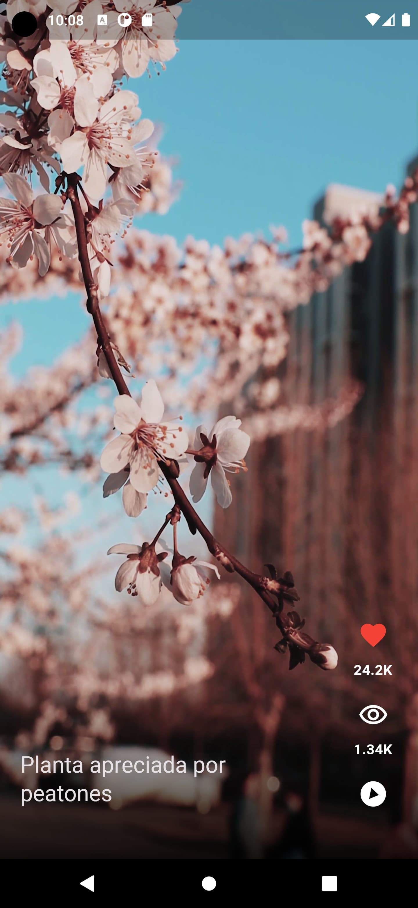

# tiki_Toko - a Flutter Proyect

Tiki Toko

## Getting Started

It is an app inspired by Tik Tok to play videos.

The implementation is made to play videos locally.

> important the **videos are not included** in the repository because they occupy many MB.

You can download 8 videos from here:
[Pexels Free Videos](https://www.pexels.com/search/videos/vertical/)

Rename those videos like this, since it is what is in our data source.

copy and paste the videos in the ./assets/videos folder

```
1.mp4
2.mp4
3.mp4
4.mp4
5.mp4
6.mp4
7.mp4
8.mp4
```

## example image

- 
